# **Proyecto**

# Crear un proyecto en el lenguaje de programación de Python conectado con una base de datos No SQL

**Orden en ejecutar el programa**

1. **Ejecutar el servidor cliente de mongo**
2. **Abrir MongoDBCompass**
3. **Ejecutar el código del programa con python**

**Capturas de ejecución:**

1. **Para ejecutar el cliente de mongo, debemos escribir "mongod" en PowerShell**

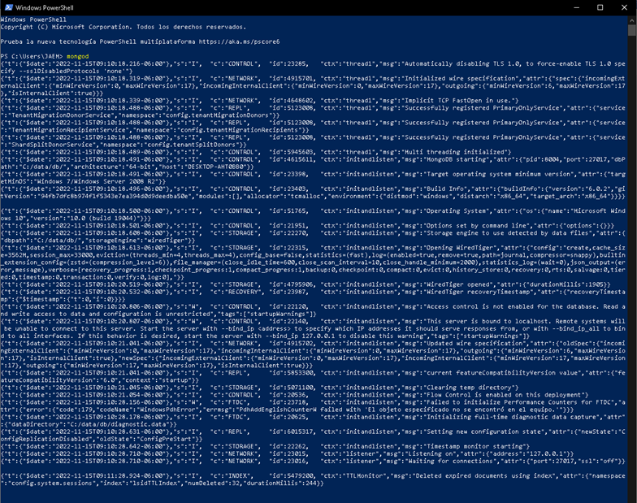

1. **Abrimos MongoDBCompass y nos conectamos al puerto que nos dio al iniciar el cliente de Mongod**

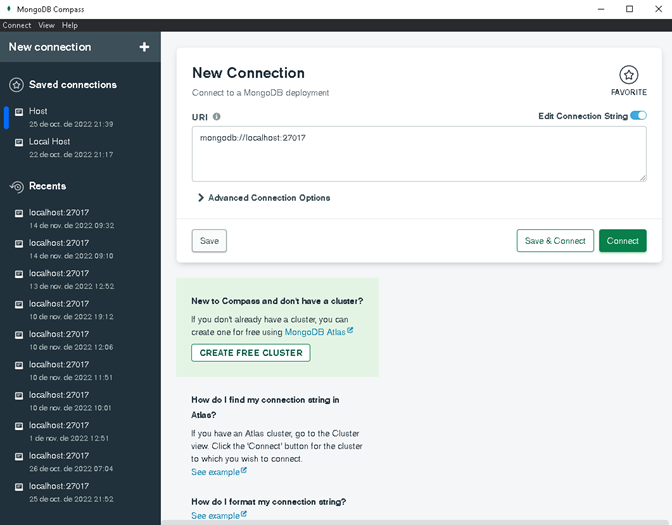

**Yo ya tengo creada la base de datos App\_QR con la colección CodigosQR**

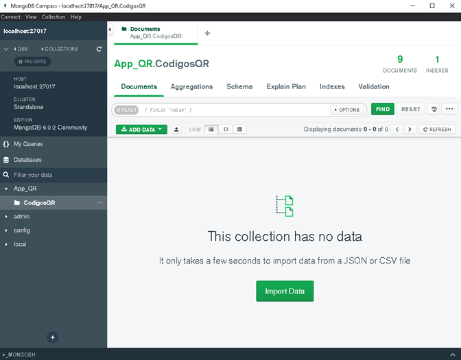

1. **Ejecutar el código del programa con Python**

**En este caso yo lo ejecuto desde la terminal de visual studio code**

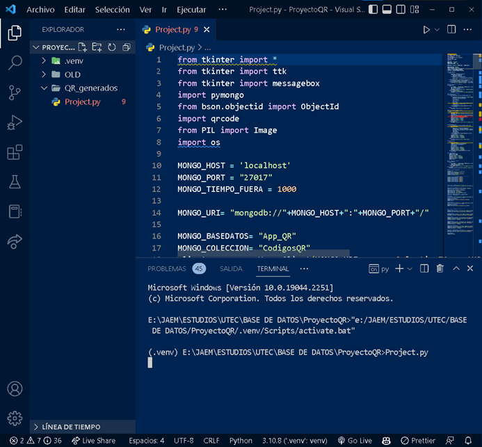

**Lo encapsulé para que todo lo que e importado lo sigua usando, ya que me encontré con varios errores de cosas que cambian con las versiones de pymongo, incluso el IDE me marca unos errores, pero en realidad el programa no tiene ningún error al ejecutarse**

**Se abrirá la siguiente ventana con el programa**

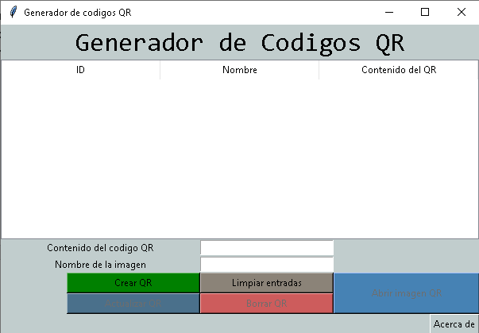

**(Para Actualizar QR, Borrar QR y Abrir imagen QR,**  **SE DEBE HACER DOBLE CLIC SOBRE EL REGISTRO**** )**

**La ventana contiene una tabla donde se pueden visualizar los datos de los Códigos QR generados, contiene dos entradas de texto, una para lo que contendrá el Código QR y otra para el nombre que se le asignará a la imagen del Código QR**

**Los botones de la parte inferior pueden hacer lo siguiente**

**Crear QR:** Crea un nuevo Código QR a partir de la entrada de datos que se coloque y los guarda en la base de datos de App\_QR y la imagen la guarda en "./QR\_generados" en la carpeta del programa

**Actualizar QR:** Actualiza el contenido, el nombre del Código QR y genera un nuevo Código QR con los nuevos datos, también actualiza los datos en la base de datos, a partir de su identificador (ID).

**Limpiar entradas** : Este botón deja en blanco las entradas y vuelve a habilitar el botón Crear QR, puesto que si selecciono algún elemento los botón Crear QR se deshabilita porque no se puede crear un Código QR mientras se edita al mismo tiempo.

**Borrar QR:** Borra el registro de la base de datos, (No borra la imagen, puesto que puede que el usuario la ocupe)

**Abrir imagen QR:** Este botón hace lo que dice.

**Acerca de:** Información del programa.

**Ejemplos de Crear QR, Actualizar QR y Borrar QR (leer está implícito)**

Crear 4 Códigos QR

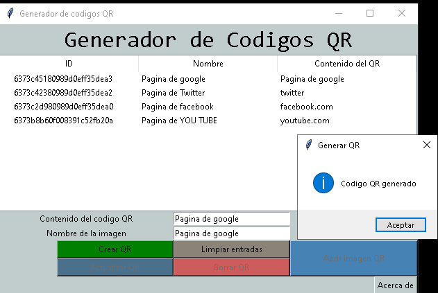

Editar un registro

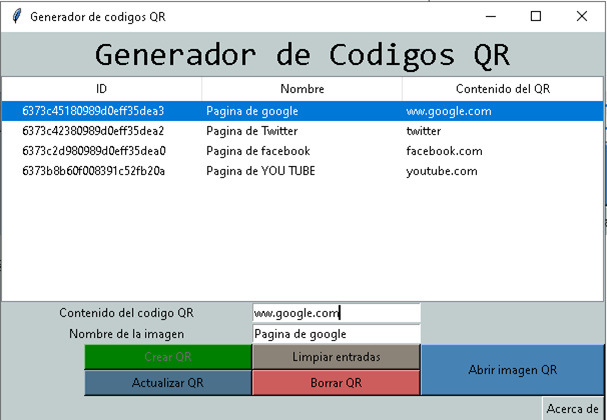

Borrar un registro

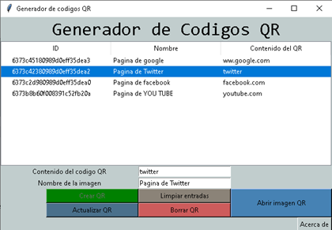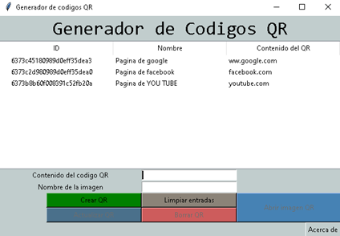

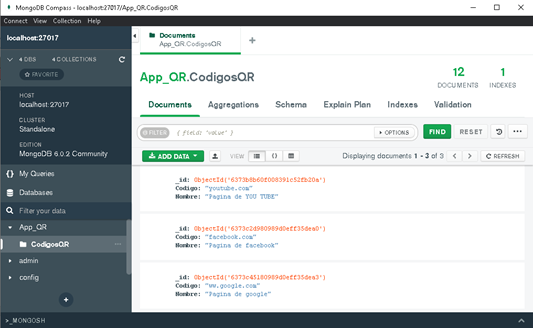

Abrir imagen de un codigo QR

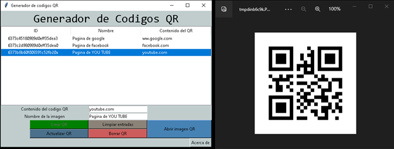

Comprobando que el Código QR si se generó correctamente

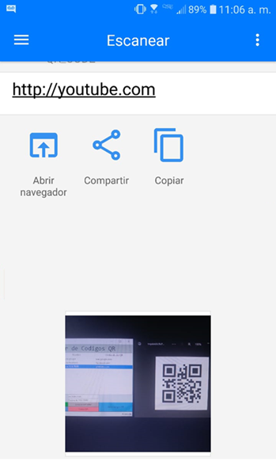